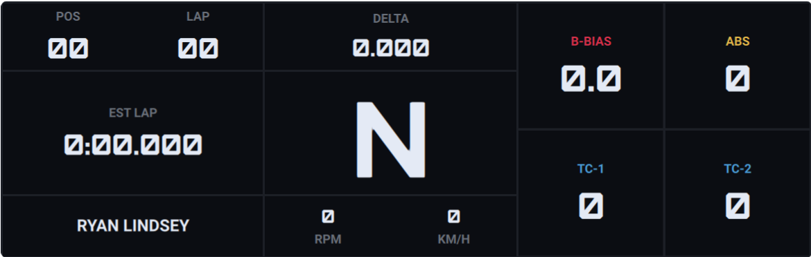

# Pixelsonly Racing — Moza Dashboards

[](https://github.com/pixelsonly/moza-downloads/actions/workflows/ci.yml)
[](https://github.com/pixelsonly/moza-downloads/releases)
[](https://github.com/giantorth/AZOM)
[](https://www.conventionalcommits.org/)

Custom wheel-screen dashboards for Moza sim racing hardware, designed and built by
Pixelsonly Racing. Each dashboard is released on its own, and every release has a
ready-to-install `.zip` on the [Releases](https://github.com/pixelsonly/moza-downloads/releases) page.

> [!NOTE]
> MOZA is a registered trademark of Gudsen Technology Co., Ltd. This project is not affiliated with, endorsed by, or sponsored by MOZA.

## Dashboards

| Dashboard | Wheel | Version | Preview | Download |
|---|---|---|---|---|
| Pixelsonly Racing KSP01 | Moza KS Pro |  |  | [Latest KSP01 release](https://github.com/pixelsonly/moza-downloads/releases?q=ksp01&expanded=true) |

Each download is named `pixelsonly-racing-<slug>-v<version>.zip`, where the slug names the
wheel it is for, for example `pixelsonly-racing-Moza-KS-PRO-v0.1.0.zip`. It holds one folder named after the
dashboard, which contains the `.mzdash` file, a `Resource/` folder and the preview images.

## Install: SimHub + AZOM (recommended)

[AZOM](https://github.com/giantorth/AZOM) is an open-source SimHub plugin that drives
Moza hardware, including the wheel's LCD dashboard.

1. Install SimHub 9.12.0 or newer.
2. Install AZOM by following its [install guide](https://giant.orth.cc/guides/install-the-plugin/).
3. **Fully close Moza Pit House** (don't just minimize it). Pit House and SimHub share the
   same serial port, so they can't both be connected.
4. Download the dashboard's `.zip` from [Releases](https://github.com/pixelsonly/moza-downloads/releases) and extract it.
5. Upload the extracted `.mzdash` file to your wheel by following AZOM's
   [Wheel Files & Dashboard Upload](https://giant.orth.cc/guides/wheel-files/) guide.

## Install: Moza Pit House

1. Download the dashboard's `.zip` from [Releases](https://github.com/pixelsonly/moza-downloads/releases) and extract it.
2. In Pit House's dashboard editor, import the extracted folder (e.g. `Pixelsonly Racing KSP01/`).
   Pit House imports the whole folder, which is how it picks up the preview images.

## Building from source

Requirements: Python 3.9+ (standard library only) and Node.js, which the tests use to
evaluate the dashboards' JavaScript bindings.

```sh
python3 dashboards/ksp01/build.py           # writes dist/Pixelsonly Racing KSP01/
python3 scripts/package.py ksp01 0.1.0      # writes dist/pixelsonly-racing-Moza-KS-PRO-v0.1.0.zip
scripts/check.sh                            # every test suite + build and package every dashboard (what CI runs)
scripts/check.sh ksp01                      # the same, for one dashboard (what a release runs)
```

Layout:

- `generator/`: the shared `.mzdash` writer, value formatters and widget templates.
- `dashboards/<id>/`: one folder per dashboard: `dashboard.json`, `build.py`, `test_build.py`, `previews/`.
- `scripts/`: packaging and the check script used by CI.

### Adding a dashboard

1. Create `dashboards/<id>/` with a `build.py` (see `dashboards/ksp01/build.py`), its
   tests, `previews/`, and a `dashboard.json`:

   ```json
   {
     "name": "Pixelsonly Racing KSP01",
     "slug": "Moza-KS-PRO",
     "wheel": "Moza KS Pro",
     "previews": ["previews/1.png", "previews/2.png"]
   }
   ```

   `slug` goes in the download's file name and must be unique across dashboards. CI
   enforces this.
2. Register it with release-please. Add `"dashboards/<id>": { "component": "<id>" }` to
   `packages` in `release-please-config.json`, and `"dashboards/<id>": "0.0.0"` to
   `.release-please-manifest.json`. `scripts/check.sh` fails if a dashboard folder and the
   release config disagree.
3. Add a row to the table above. For its version badge, copy KSP01's and replace `ksp01` in the
   badge's `query` and `label`.

### How releases work

- PRs are squash-merged, and the PR title must be a
  [Conventional Commit](https://www.conventionalcommits.org/) with the dashboard id as
  the scope, e.g. `feat(ksp01): add fuel readout` or `fix(ksp01): correct delta colour`.
- Each dashboard is its own [release-please](https://github.com/googleapis/release-please)
  package. Only commits that touch `dashboards/<id>/` count toward that dashboard's next
  release. If a change to `generator/` alters a dashboard's output, the same PR must also
  change something under `dashboards/<id>/` (for example its `build.py` or tests).
  Otherwise, no release is cut. A `Release-As:` footer on a generator-only commit is
  ignored.
- release-please opens a release PR per dashboard. Merging it publishes a release tagged
  `<id>-v<version>` (e.g. `ksp01-v0.1.0`). The `release-assets` workflow then builds the
  dashboard from that tag and attaches the `.zip`. To rebuild an existing release, run
  `release-assets` manually with the tag.
